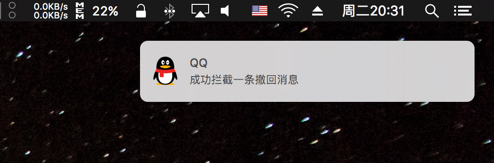

# QQTweak-macOS

QQ macOS 客户端 Tweak 动态库。

## 截图

## 功能

- 阻止消息撤回

## Todo

- [x] 修复数据文件储存路径
- [ ] 增加撤回通知详细信息
- [ ] 增加 Alfred 支持

## 使用

- `sudo make install`   安装动态库
- `sudo make uninstall` 卸载动态库

## 依赖

- [insert_dylib](https://github.com/Tyilo/insert_dylib)
- [fishhook](https://github.com/facebook/fishhook)

## 参考

- [WeChatTweak-macOS](https://github.com/Sunnyyoung/WeChatTweak-macOS)

## License

The [Apache-2.0 License](LICENSE).

